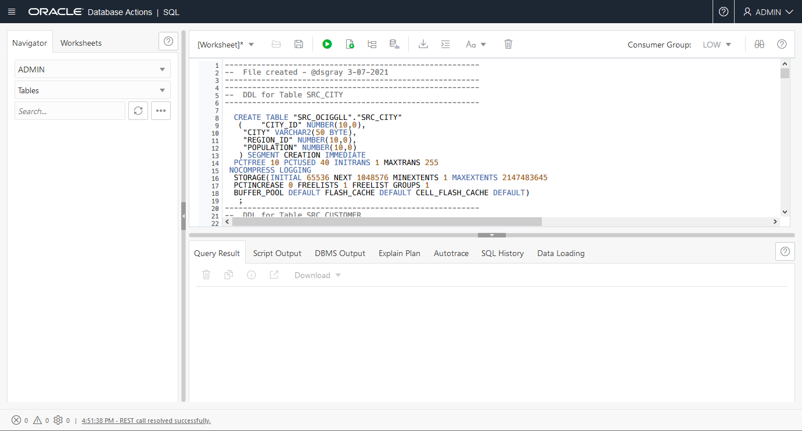

# Set up the environment

## Introduction

This lab walks you through the steps to create the required resources you'll use for Oracle Cloud Infrastructure (OCI) GoldenGate. We'll show you how to create a VCN and subnet, provision autonomous database instances, and load data into the databases.

Estimated time: 20 mins

### Objectives

-  Learn to provision a VCN and subnet
-  Learn how to provision, connect, and load data into an Autonomous Transaction Processing (ATP) instance
-  Learn how to provision an Autonomous Data Warehouse (ADW) instance

### Prerequisites

This lab assumes you have completed the following labs:
* Sign Up for Free Tier/Login to Oracle Cloud

> **Note:** *You may see differences in account details (eg: Compartment Name is different in different places) as you work through the labs. This is because the workshop was developed using different accounts over time.*

In this section, you will provision a VCN and subnet, ATP and ADW instances, and load data to use with OCI GoldenGate.

> **Note:** *This workshop was designed to use Oracle Autonomous Databases as the source and target. If you plan to use Oracle Database, ensure that you use the CDB user to capture data from the PDBs.*

## Task 1: Create a VCN and subnet

1.  Open the **Navigation Menu**, navigate to **Networking**, and select **Virtual Cloud Networks**.

	

2.  On the **Virtual Cloud Networks in &lt;compartment-name&gt;** page, click **Start VCN Wizard**.

	

3.  In the Start VCN Wizard dialog, select **VCN with Internet Connectivity**, and then click **Start VCN Wizard.**

    

4.  Enter a name for the VCN, select a compartment, and then click **Next**.

    

5.  Verify the configuration, and then click **Create**.

    

You can click View VCN Details and see both a Public and Private subnet were created.

## Task 2: Create an ATP instance

1.  Open the **Navigation Menu**, navigate to **Oracle Database**, and select **Autonomous Transaction Processing**.

	

2.  On the **Autonomous Database &lt;compartment-name&gt;** page, click **Create Autonomous Database**.

    

3. For **Compartment** select a compartment from the dropdown. (Note that yours will be different - do not select **ManagedCompartmentforPaaS**) and then enter **ATPSource** for **Display Name** and **Database Name**.

    

4.  Under **Choose a workload type**, select **Transaction Processing**.

    

5.  Under **Choose a deployment type**, select **Shared Infrastructure**.

    

6.  Under **Configure the database**, leave **Choose database version** and **Storage (TB)** and **OCPU Count** as they are.

7.  Add a password. Take note of the password, you will need it later in this lab.

    

8.  Under **Choose a license type**, select **License Included**.

    

9.  Click **Create Autonomous Database**. Once it finishes provisioning, you can click on the instance name to see details of it.


## Task 3: Load the ATP schema

1.  Click the following link to download the database schema.

    [Livelab will load the Terraform script.zip](.zip)

2.  Save `Archive.zip` to a download directory, and then unzip the file.

3.  Back in the OCI Console, select your ATP instance from the Autonomous Databases page to view its details and access tools.

    

4.  Click **Open DB Actions**.

5.  Log in with the ADMIN user and password provided when you created the ATP instance.

    

6.  From the Database Actions menu, under **Development**, select **SQL**.

    

7.  (Optional) Click **X** to close the Help dialog.

8.  Copy and paste the SQL script from **OCIGGLL\_OCIGGS\_SETUP\_USERS\_ATP.sql** into the SQL Worksheet.

    

9.  Click **Run Script**. The Script Output tab displays confirmation messages.

10. Copy and paste the SQL script from **OCIGGLL\_OCIGGS\_SRC\_USER\_SEED\_DATA.sql** a new SQL Worksheet.

    

11. Click **Run Script**. The Script Output tab displays confirmation messages.

	>**Note:** *If you find that running the entire script does not create the tables, then try running each table creation statement one at a time until all the tables are created.*

12. In the Navigator tab, look for the SRC\_OCIGGLL schema and then select tables from their respective dropdowns to verify the schema and tables were created. You may need to log out and log back in if you can't locate SRC\_OCIGGLL.

    

13. To enable supplemental logging, run the following command:

    ```
    <copy>ALTER PLUGGABLE DATABASE ADD SUPPLEMENTAL LOG DATA;</copy>
    ```
## Task 4: Download Oracle Resource Manager (ORM) stack zip file
1.  Click on the link below to download the Resource Manager zip file you need to build your environment:

    - [ggsa-mkplc-freetier.zip](https://objectstorage.us-ashburn-1.oraclecloud.com/p/n0et2ROGw0W7FArTFQEUdzJ3UhXBWLbCMZ3buNxAtXRHgBiygUYxWxyTqH61pve9/n/natdsecurity/b/stack/o/ggsa-mkplc-freetier.zip)

2.  Save in your downloads folder.

We strongly recommend using this stack to create a self-contained/dedicated VCN with your instance(s). Skip to *Step 3* to follow our recommendations. If you would rather use an exiting VCN then proceed to the next step as indicated below to update your existing VCN with the required Egress rules.

## Task 5: Adding Security Rules to an Existing VCN   
This workshop requires a certain number of ports to be available, a requirement that can be met by using the default ORM stack execution that creates a dedicated VCN. In order to use an existing VCN the following ports should be added to Egress rules

| Port           |Description                            |
| :------------- | :------------------------------------ |
| 22             | SSH                                   |
| 80             | GGMA Console (http)                   |
| 443            | GGMA Console (https)                  |
| 6080           | noVNC Remote Desktop                  |

1.  Go to *Networking >> Virtual Cloud Networks*
2.  Choose your network
3.  Under Resources, select Security Lists
4.  Click on Default Security Lists under the Create Security List button
5.  Click Add Ingress Rule button
6.  Enter the following:
    - Source CIDR: 0.0.0.0/0
    - Destination Port Range: *Refer to above table*
7.  Click the Add Ingress Rules button

## Task 6: Setup Compute   
Using the details from the two steps above, proceed to the lab *Environment Setup* to setup your workshop environment using Oracle Resource Manager (ORM) and one of the following options:
  -  Create Stack:  *Compute + Networking*
  -  Create Stack:  *Compute only* with an existing VCN where security lists have been updated as per *Step 2* above

## Acknowledgements

- **Author** - Jenny Chan, Consulting User Assistance Developer
- **Last Updated** - June 2022
- **PAR Expiration date** - June 31, 2022
