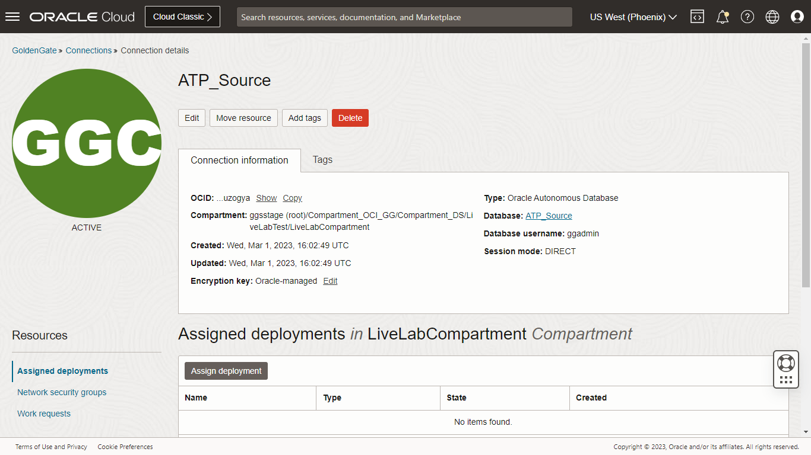

# Create and assign connections

## Introduction

This lab walks you through the steps to create a connection to ***ATP*** and ***Kafka*** from an Oracle Cloud Infrastructure (OCI) GoldenGate deployment.

Estimated Time: 5 minutes

### About Creating the ATP and Kafka Connection

You can create and save the database login credentials, Kafka connectivity, and assign the global credentials to appropriate deployments.

### Objectives

In this lab, you will:
* Create a connection to ATP
* Create a connection to Apache Kafka
* Assign the connections to their respective deployments

### Prerequisites

This lab assumes that you completed all preceding labs.

## Task 1: Create a connection to ATP

Follow these steps to create a connection to the source Autonomous Transaction Processing (ATP) database.

1.  Open the **Navigation Menu**, navigate to **Oracle Database**, and select **GoldenGate**.

    

2.  On the GoldenGate **Connections** page, click **Create connection**.

    

3.  In the Create connection panel, enter **ATP_Source** for Name.

4.  From the Compartment dropdown, select a compartment. For example, **LiveLabCompartment**.

5.  For Type, select **OCI Autonomous Database** and click **Next**.
    

6.  For Database details, choose Select database, and then select the ATP database created in Lab 1. Enter ***ggadmin*** for Database username, and , ***Or4cl3--2022*** for password, and then click  **Create**.
    

## Task 2: Create a connection to Apache Kafka

Follow the steps below to create a connection to the target  Apache Kafka.

1.  Open the **Navigation Menu**, navigate to **Oracle Database**, and select **GoldenGate**.

    

2.  On the GoldenGate **Connections** page, click **Create connection**.

    

3.  In the Create connection panel, enter **kafka** for Name.

4.  From the Compartment dropdown, select a compartment. For example, **LiveLabCompartment**.

5.  For Type, select **Apache Kafka**, and then click **Next**.
    

6.  For Host, enter the public IP of the Kafka Bootstrap servers configured in Lab 1.

7.  For Port, enter **9092**
    
8.  For Security protocol, select **Plaintext**, and then click **Create**.

## Task 3: Assign Connections to Deployments
1. On the Connections page, select  **ATP_Source**.

    

2. On the Connection details page, under Resources, click **Assigned deployments**, and then click **Assign deployment**.
    
3.	In the Assign deployment dialog, select **GGSDeployment** from the dropdown, and then click **Assign deployment**.
    

4.	Repeat these steps to assign ***OCI GoldenGate Big Data*** to the Kafka connection.

In this lab, you created a connection to source ATP and target Apache Kafka.

You may now **proceed to the next lab**.

## Learn More

* [Manage Deployment users](https://docs.oracle.com/en/cloud/paas/goldengate-service/using/manage-user-accounts.html#GUID-56E2E146-7713-4094-8BEC-7C138064EB21)

## Acknowledgements
* **Author** - Madhu Kumar S, Senior Solution Engineer, AppDev and Integration 
* **Contributors** -  Deniz Sendil, Database Product Management
* **Last Updated By/Date** - 
