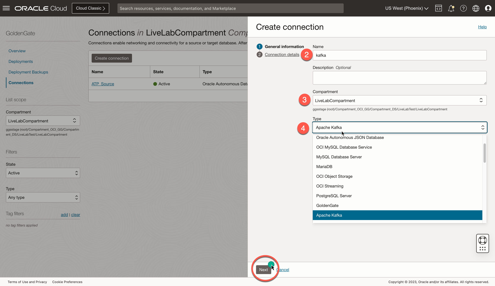
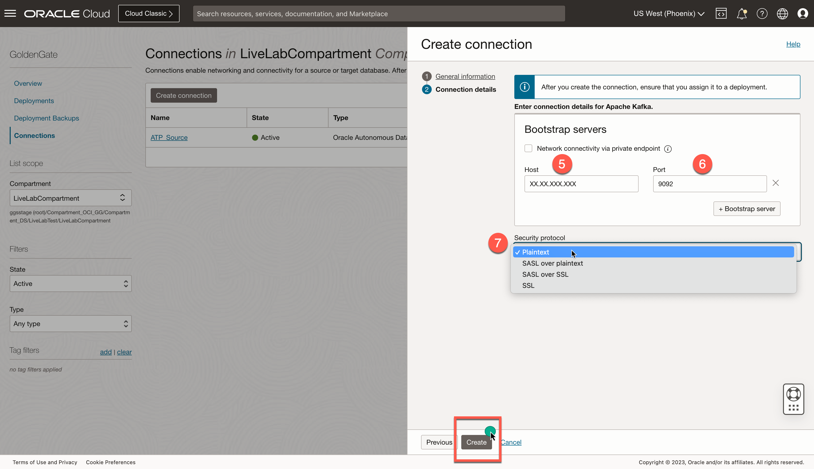
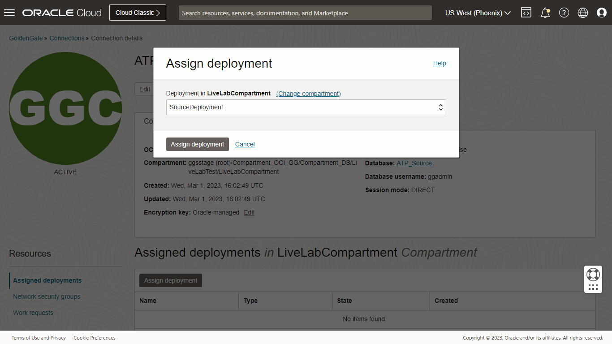

# Create the ATP and Kafka Connection

## Introduction

This lab walks you through the steps to create a connection to ***ATP*** and ***Kafka*** from an Oracle Cloud Infrastructure (OCI) GoldenGate deployment.

Estimated time: 5 minutes

### About Creating the ATP and Kafka Connection

You can create and save the database login credentials, Kafka connectivity, and assign the global credentials to appropriate deployments.

### Objectives

In this lab, you will:
* Locate Oracle Cloud Infrastructure GoldenGate in the Console
* Create a connection to ATP and Kafka from OCI GOldenGate deployment

### Prerequisites

This lab assumes that you completed all preceding labs.

## Task 1: Create a connection to ATP

First, follow the steps below to create a connection to the source Oracle Autonomous Transaction Processing \(ATP\) Database and target Apache Kafka.

1.  Open the **Navigation Menu**, navigate to **Oracle Database**, and select **GoldenGate**.

    

2.  On the GoldenGate **Connections** page, click **Create connection**.

    

3.  In the Create connection panel, enter **ATP_Source** for Name.

4.  From the Compartment dropdown menu, select a compartment (in this lab,we choose compartment as **LiveLabCompartment**).

5.  Select Type as **OCI Autonomous Database** and click Next.
    

6.  On the Create connection **Connection details** page, choose the radio button **Select Database** to select the **ATP Database** that was created in **Lab 1**. Provide Database username as ***ggadmin***, password as ***Or4cl3--2022*** and click Create.
    

## Task 2: Create a connection to Apache Kafka

Follow the steps below to create a connection to the target  Apache Kafka.

1.  Open the **Navigation Menu**, navigate to **Oracle Database**, and select **GoldenGate**.

    

2.  On the GoldenGate **Connections** page, click **Create connection**.

    

3.  In the Create connection panel, enter **kafka** for Name.

4.  From the Compartment dropdown menu, select a compartment (in this lab, we choose compartment as **LiveLabCompartment**).

5.  Select Type as **Apache Kafka** and click Next.
    

6.  On the Create connection **Connection details** page, provide the public IP of Bootstrap servers of Kafka OCI Instance that was configured in Lab 1 for **Host**. Port as **9092**. Select Security Protocol as **Plaintext** and click Create.
    

## Task 3: Assign Connections to Deployments
1. Go to Connections and click on **ATP_Connection** which was created in ***Task 1***. Click ***Assign Deployment***.

    
2. Select OCI GoldenGate deployment as ***GGSDeployment*** and click **Assign Deployment**.

    

3.	Go back to **Connections** and click on **Kafka Connection** that was created in **Task 2**.

    
4.	Select OCI GoldenGate for Big Data deployment as ***OCI GoldenGate Big Data*** and click Assign Deployment.
    
In this lab, you created a connection to source ATP and target Apache Kafka.

## Learn More

* [Manage Deployment users](https://docs.oracle.com/en/cloud/paas/goldengate-service/using/manage-user-accounts.html#GUID-56E2E146-7713-4094-8BEC-7C138064EB21)

## Acknowledgements
* **Author** - Madhu Kumar S, Senior Solution Engineer, AppDev and Integration 
* **Contributors** -  Deniz Sendil, Database Product Management
* **Last Updated By/Date** - 
