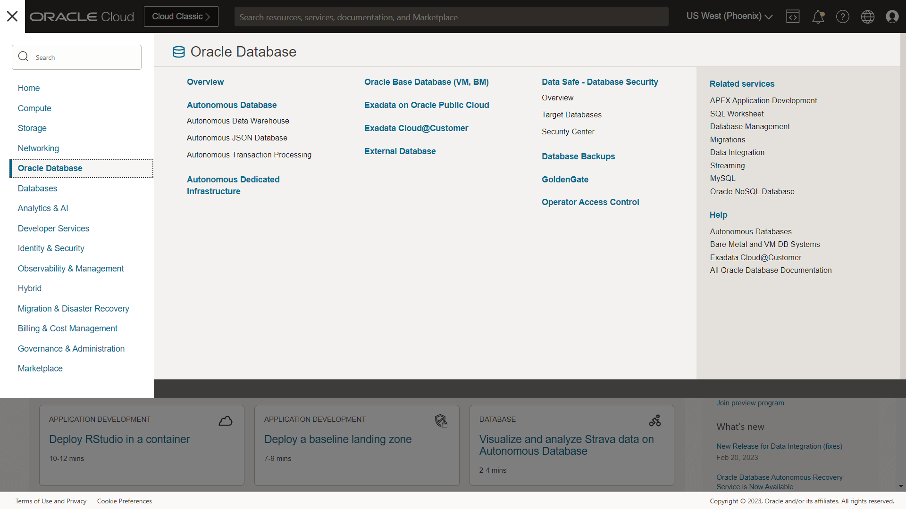
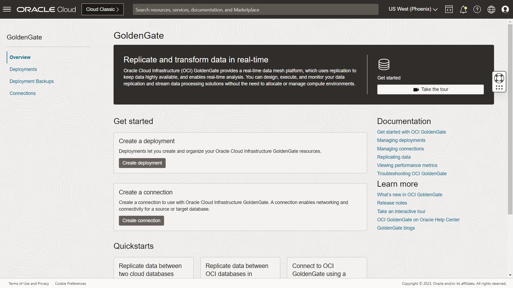
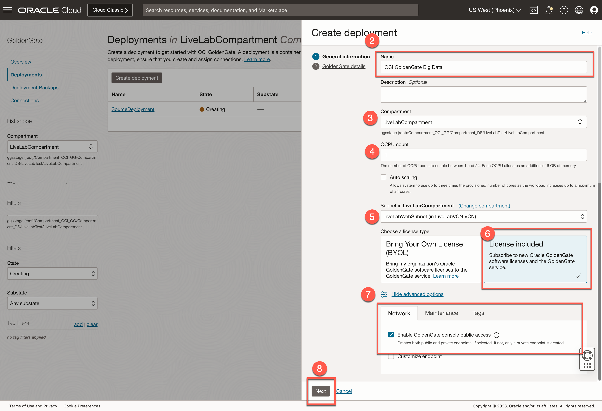

# Create the OCI GoldenGate deployments

## Introduction

This lab walks you through the steps to create an Oracle Cloud Infrastructure (OCI) GoldenGate deployment.

Estimated Time: 5 minutes

### About Oracle Cloud Infrastructure GoldenGate Deployments

Oracle Cloud Infrastructure GoldenGate deployment manages the resources it requires to function. The GoldenGate deployment also lets you access the GoldenGate deployment console, where you can access the OCI GoldenGate deployment console to create and manage processes such as Extracts and Replicats.

### Objectives

In this lab, you will:
* Locate Oracle Cloud Infrastructure GoldenGate in the Console
* Create an OCI GoldenGate deployment
* Review the OCI GoldenGate deployment details
* Access the OCI GoldenGate deployment console

### Prerequisites

This lab assumes that you completed all preceding labs.

## Task 1: Create the source deployment

1.  Open the **Navigation Menu**, navigate to **Oracle Database**, and select **GoldenGate**.

    

2.  On the GoldenGate **Overview** page, click **Create Deployment**.

    
3.  You may need to select a compartment. Under List Scope, from the Compartment dropdown, expand the root compartment, and then select the compartment **LiveLabCompartment**.

4.  In the Create Deployment panel, enter **GGSDeployment** for Name.

5.  From the Compartment dropdown, select a compartment **LiveLabCompartment**.

6.  For OCPU Count, enter **1**.

7.  For Subnet, select a subnet. If you're using the workshop environment, select the subnet as  **LiveLabWebSubnet**.

8.  For License type, select **Bring Your Own License (BYOL)**.

9. Click **Show Advanced Options**, and then select **Create Public Endpoint**.

    

10. Click **Next**.
11. Select a technology such as **Oracle Database**.

11. For GoldenGate Instance Name, enter **ggsource**.

12. For Administrator Username, enter **oggadmin**.

13. For Administrator Password, enter a password. Take note of this password.

>**Note:** This password needs to match password of a database user that we will use later. In order to make sure the password works for both, we suggest you enter a password containing only upper case letters, lower case letters, numbers, and underscores. If you are using the green button (run on LiveLabs tenancy), you can use your database admin password given to you on the reservation page.

14. Click **Create**.

    

You're brought to the Deployment Details page. It takes a few minutes for the deployment to be created. Its status will change from CREATING to ACTIVE when it is ready for you to use.

## Task 2: Create the target deployment.

> **Note:** *Compartment names in the screenshots may differ from values that appear in your environment.*

1. Go back to the GoldenGate **Overview** page, click **Create Deployment**.

    
3.  You may need to select a compartment. Under List Scope, from the Compartment dropdown, expand the root compartment, and then select the compartment **LiveLabCompartment**.

4.  In the Create Deployment panel, enter **OCI GoldenGate Big Data** for Name.

5.  From the Compartment dropdown, select a compartment.

6.  For OCPU Count, enter **1**.

7.  For Subnet, select a subnet. If you're using the workshop environment, select **LiveLabWebSubnet**.

8.  For License type, select **License included**.
9.  Click **Show Advanced Options**, and then select **Create Public Endpoint**.

9. Click **Next**.
    

10. Select Technology as  **Big Data**.

11. For GoldenGate Instance Name, enter **OCIGGBigData**.

12. For Administrator Username, enter **oggadmin**.

13. For Administrator Password, enter a password. Take note of this password.

>**Note:** This password needs to match password of a database user that we will use later. In order to make sure the password works for both, we suggest you enter a password containing only upper case letters, lower case letters, numbers, and underscores. If you are using the green button (run on LiveLabs tenancy), you can use your database admin password given to you on the reservation page.

14. Click **Create**.

    

> **Note:** *You're brought to the Deployment Details page. It takes a few minutes for the deployment to be created. Its status will change from CREATING to ACTIVE when it is ready for you to use.*

You may now **proceed to the next lab**.

## Learn More

* [Managing Deployments](https://docs.oracle.com/en/cloud/paas/goldengate-service/using/deployments.html)

## Acknowledgements
* **Author** - Jenny Chan, Consulting User Assistance Developer, Database User Assistance
* **Contributors** -  Denis Gray, Database Product Management; Madhu Kumar S, AppDev and Integration
* **Last Updated By/Date** - 

