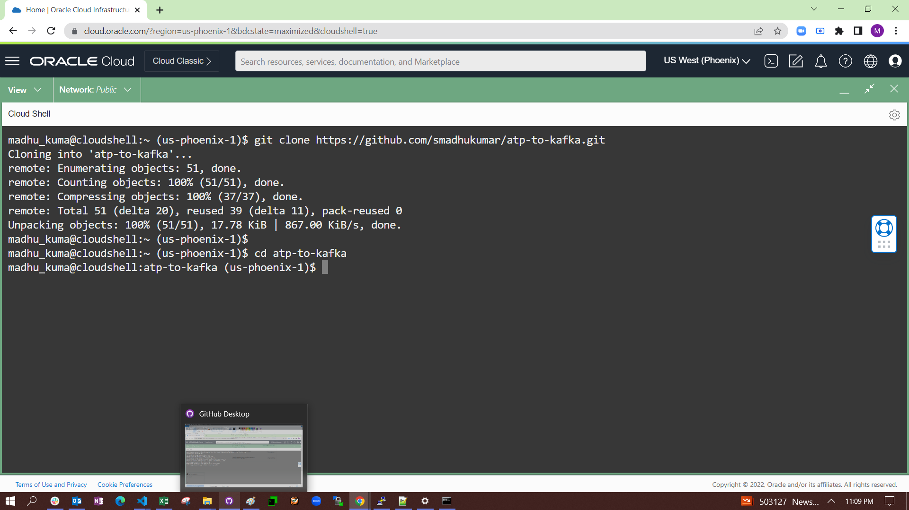
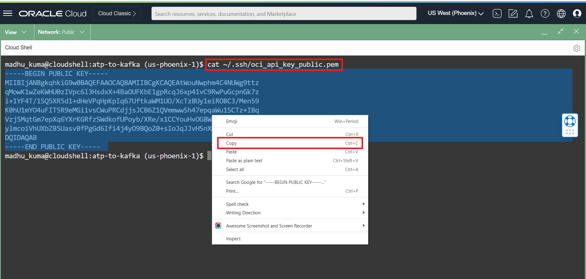
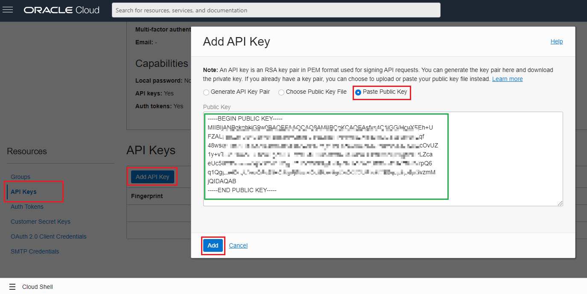
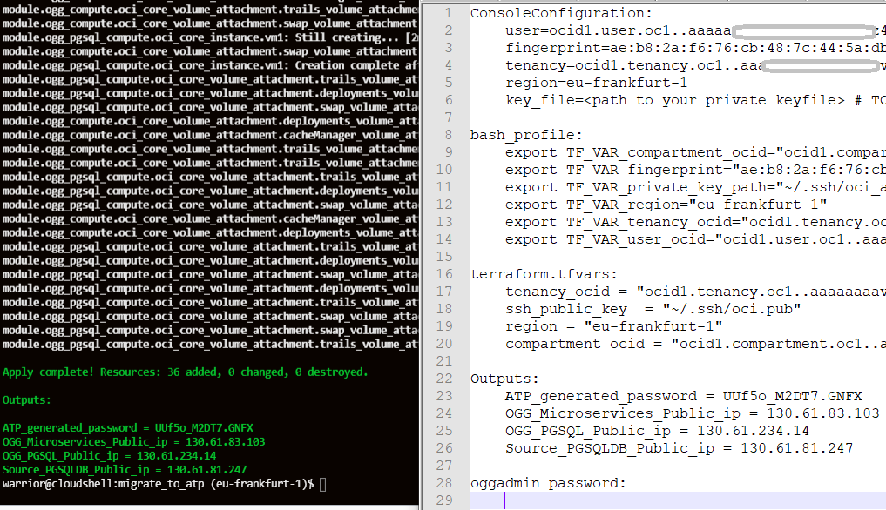

# Environment Setup

## Introduction

In this lab, we will show you how to prepare your work environment in Oracle Cloud Infrastructure. We will use Cloud Shell which is a web-based terminal built into OCI console. To use the Cloud Shell machine, your tenancy administrator must grant your the required IAM (Identity and Access Management) policy.

This lab is very important and we will create following resources:

- Virtual Cloud Network
- Source Oracle Autonomous Database.
- Target Apache Kafka Node.


**Make sure** you have the following compute quotas and resources available to use:

1. ATP for Source database - 1 OCPU, 1 TB storage
2. Virtual Machine for Apache Kafka - VM.Standard1.1


*Estimated lab time*: 10 minutes

### Objectives

In this first lab, we will prepare our work environment and create our lab resources using a Terraform script.

-   Create SSH keys in a Cloud Shell environment.
-	Modify a terraform variables file to interact with the script.
-   Prepare our work environment and create our lab resources using a Terraform script.

	


### Prerequisites

* The following workshop requires an Oracle Public Cloud Account that will either be supplied by your instructor or can be obtained through **Getting Started** steps.
* A Cloud tenancy is where you have the resources available to provision what is listed in the Architecture Overview.
* Oracle Cloud Infrastructure supports the following browsers and versions: Google Chrome 69 or later, Safari 12.1 or later, and Firefox 62 or later.
* Your cloud account user must have the required IAM (Identity and Access Management) policy or admin user.
* Successfully logged in to your cloud tenancy, if not please [login](https://www.oracle.com/cloud/sign-in.html) into your cloud account.

## Task 1: Open Cloud Shell

1. Let's prepare our work directory. We will use Cloud Shell, it is located at the top right corner of the OCI web console

	

## Task 2: Clone Lab Repository

1. Let's begin our lab. First, we'll make a copy of the lab repository and go to the cloned directory. In your Cloud Shell web terminal, issue the below commands.

	```
	<copy>
	git clone https://github.com/smadhukumar/atp-to-kafka.git
	cd atp-to-kafka
	

	</copy>
	```

	

## Task 3: Generate SSH keys

1. Once the cloud shell environment is ready, issue the below 4 lines of commands. This will create the ssh key files and the API signing keys:

	```
	<copy>
	chmod +x generate_pemkey.sh

	./generate_pemkey.sh

	</copy>
	```

2. Copy your public _**pem**_ file content:

	```
	<copy>
	cat ~/.ssh/oci_api_key_public.pem
	</copy>
	```

	

## Task 4: Add Public API keys and Modify Terraform variables

1. Click on the top right corner of your OCI web console and click on your **profile**. Then navigate to the **API Keys** from the left pane and click on the **Add API Key** button. A small pop-up will appear and you need to choose the "Paste Public Key" radio button. Paste your **copied public pem key** there and click on the **Add** button.

	

2. A small confirmation will show after you added an API key. **Copy** these values and open a notepad to keep these for a later use.

	

3. Now we need to create a file to help terraform understand your environment. In the Cloud Shell, type the below command and modify **terraform.tfvars** file.

	```
	<copy>
	vi terraform.tfvars
	</copy>
	```

	_**NOTE:** This will create a new file, you have to press **i** key to enable editing, then "shift+insert" to paste copied parameter. When you are done editing press **esc** button and press **:wq** keys, then hit enter for save & quit.*_

4. Let's replace the following values in double quotes with the previously copied values in your notepad.

	```
	<copy>
	tenancy_ocid  = "replace-your-tenancy-value-here"
	region = "replace-your-region-value here"
	compartment_ocid = "replace-your-tenancy-value_here"
	fingerprint="replace-your-fingerprint-value"
	user_ocid="replace-your-user-ocid-value"
	</copy>
	```

	_**NOTE:** if you are an experienced OCI user, I'd highly suggest you use your own compartment to isolate all resources. To do so, provide your preferred compartment OCID in `compartment_ocid`. If you are new to OCI cloud, just enter your Tenancy value as compartment OCID._

## Task 5: Terraforming

1. It is time to initialize terraform. Run the below command to download the necessary terraform files from the OCI provider.

	```
	<copy>
		terraform init
	</copy>
	```

2. Plan and apply steps should not ask for any input from you. If it asks you to provide, for example; _**`compartment_ocid`**_ , then check previous steps.

	```
	<copy>
	terraform plan

	terraform apply --auto-approve
	</copy>
	```
	After you ran the apply command, terraform will start the installation of a virtual machine and an autonomous database. Be patient, it will take some time. 
	
3. Make a copy of your output results in your notepad for later use.

	

**This concludes this lab. You may now [proceed to the next lab].**


## Acknowledgements

* **Author** - Madhu Kumar S, Senior Solution Engineer, AppDev and Integration 
* **Contributors** -  Deniz Sendil, Database Product Management;Divya Kashyap DevOps and Infra Cloud Engineer, Bangalore, NAC
* **Last Updated By/Date** - 
