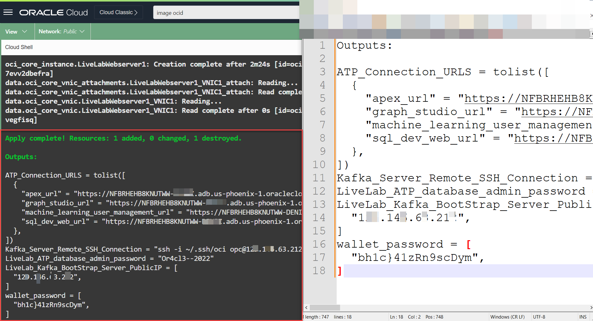

# Environment Setup

## Introduction

In this lab, you learn to set up your environment in Oracle Cloud Infrastructure using Cloud Shell. Cloud Shell is a web based terminal built into the Oracle Cloud console

This lab is very important and we will create following resources:

- Virtual Cloud Network.
- Source Oracle Autonomous Database.
- Target Apache Kafka Node.
- Create SSH keys in Cloud Shell.
- Modify a terraform variables file to interactive with the script.
- Set up your environment and create resources using the terraform script.


**Make sure** you have the following compute quotas and resources available to use:

1. ATP for Source database - 1 OCPU, 1 TB storage
2. Virtual Machine for Apache Kafka - VM.Standard1.1


Estimated Time: 20 minutes

### Objectives

In this first lab, we will prepare our work environment and create our lab resources using a Terraform script.

-   Create SSH keys in a Cloud Shell environment.
-	Modify a terraform variables file to interact with the script.
-   Prepare our work environment and create our lab resources using a Terraform script.


### Prerequisites

* The following workshop requires an Oracle Public Cloud Account that will either be supplied by your instructor or can be obtained through **Getting Started** steps.
* A Cloud tenancy is where you have the resources available to provision what is listed in the Architecture Overview.
* Oracle Cloud Infrastructure supports the following browsers and versions: Google Chrome 69 or later, Safari 12.1 or later, and Firefox 62 or later.
* Your cloud account user must have the required IAM (Identity and Access Management) policy or admin user.
* Successfully logged in to your cloud tenancy, if not please [login](https://www.oracle.com/cloud/sign-in.html) into your cloud account.

## Task 1: Use Cloud Shell to clone the lab repository

1. In the Oracle Cloud console global header, click Cloud Shell. Cloud Shell opens as a separate panel in the Oracle Cloud console, which you can expand to full screen.

  _**Note:** *It takes a few minutes for Cloud Shell to connect and load your session.*_

	

2. After Cloud Shell connects, enter the following command to clone the repository:

	```
	<copy>
	git clone https://github.com/smadhukumar/atp-to-kafka.git
	cd atp-to-kafka
	

	</copy>
	```

	

## Task 2: Generate SSH keys

1. In Cloud Shell, enter the following commands to add the execute permission to generate_pemkey.sh, and then run the file.

	```
	<copy>
	chmod +x generate_pemkey.sh

	./generate_pemkey.sh

	</copy>
	```

2. Enter the following command to copy your public pem file content:

	```
	<copy>
	cat ~/.ssh/oci_api_key_public.pem
	</copy>
	```

	

## Task 3: Add Public API keys and Modify Terraform variables

1. In the Oracle Cloud console, click **Profile**, and then select your username.
Needs to add screenshot *(Add a screenshot here of the Oracle Cloud global header with the Profile menu open.)*

	
2. On the **User Details** page, under **Resources**, click **API Keys**, and then click **Add API Key**.
* screeensot needs add * 
3. In the Add API Key dialog, select **Paste Public Key**, paste the public pem key copied from Cloud Shell into the Public Key text area, and then click **Add**.

4.  In the Configuration File Preview dialog, copy the values into a text editor so you can refer to them in the next steps.
	


5. In Cloud Shell, enter the following command to modify **terraform.tfvars**:.

	```
	<copy>
	vi terraform.tfvars
	</copy>
	```

	_**NOTE:** This creates a new file. Press i on your keyboard to enable editing, and then press Shift+Insert to paste a copied parameter. When you're done editing, press the escape key, then :wq, and then Enter to save and quit._

6. Replace the following placeholders in double quotes with the configuration file values copied to your text editor..

	```
	<copy>
	tenancy_ocid  = "replace-your-tenancy-value-here"
	region = "replace-your-region-value here"
	compartment_ocid = "replace-your-tenancy-value_here"
	fingerprint="replace-your-fingerprint-value"
	user_ocid="replace-your-user-ocid-value"
	</copy>
	```

	_**NOTE:** if you are an experienced OCI user, I'd highly suggest you use your own compartment to isolate all resources. To do so, provide your preferred compartment OCID in `compartment_ocid`. If you are new to OCI cloud, just enter your Tenancy value as compartment OCID._

## Task 4: Terraforming

1. Run the following command to download the necessary terraform values from Oracle Cloud Infrastructure.

	```
	<copy>
		terraform init
	</copy>
	```

2. Enter the following terraform commands:

	```
	<copy>
	terraform plan

	terraform apply --auto-approve
	</copy>
	```
	_**NOTE:**: Plan and apply shouldn't prompt user input. If it does, then refer to the API key configuration values copied to your text editor from Task 4._
	
3. Make a copy of the output results in your notepad for later use.

	

You may now **proceed to the next lab**.


## Acknowledgements

* **Author** - Madhu Kumar S, Senior Solution Engineer, AppDev and Integration 
* **Contributors** -  Deniz Sendil, Database Product Management;Divya Kashyap DevOps and Infra Cloud Engineer, Bangalore, NAC
* **Last Updated By/Date** - 
