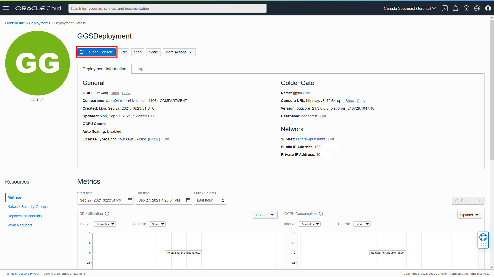
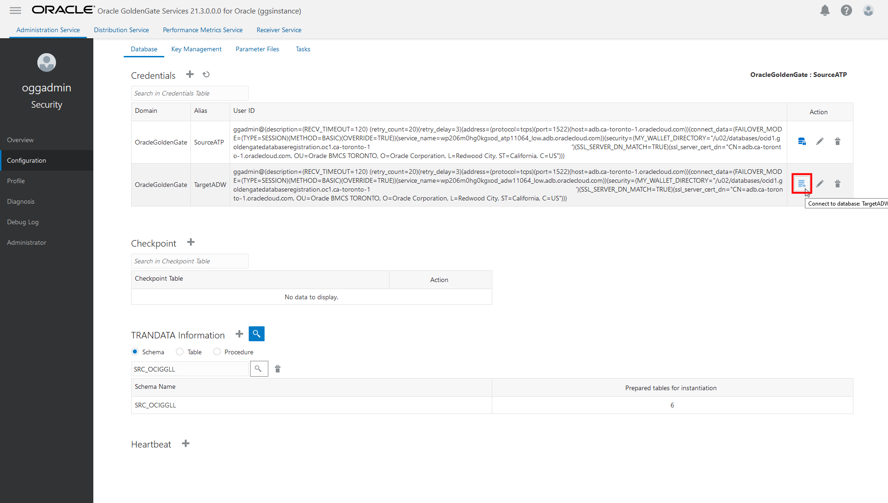
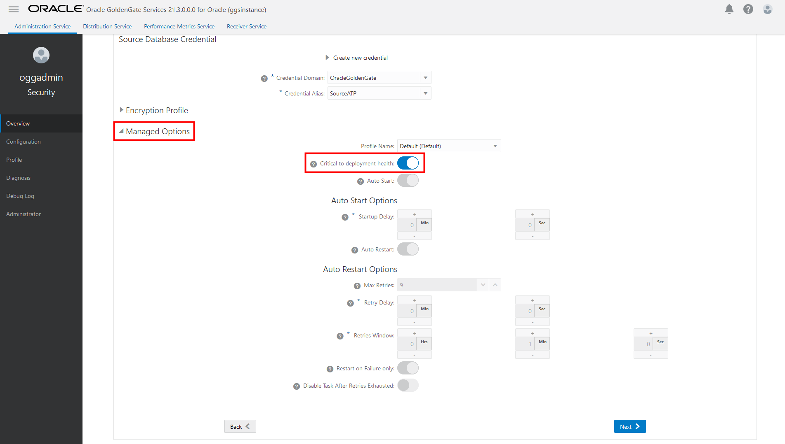

# Create and run the Extract

## Introduction

This lab walks you through the steps to create and run an Extract in the Oracle Cloud Infrastructure (OCI) GoldenGate Deployment Console.

Estimated time: 15 minutes

### About Extracts 

An Extract is a process that extracts, or captures, data from a source database. 

### Objectives

In this lab, you will:
* Log in to the OCI GoldenGate deployment console
* Add transaction data and a checkpoint table
* Add and run an Extract
* Add and run a Replicat

### Prerequisites

This lab assumes that you completed all preceding labs, and your deployment is in the Active state.

## Task 1: Log in to the Oracle GoldenGate Deployment Console

1.  Use the Oracle Cloud Console navigation menu to navigate back to GoldenGate.

2.  On the Deployments page, select **GGSDeployment**.

3.  On the Deployment Details page, click **Launch Console**.

    

4.  On the OCI GoldenGate Deployment Console sign in page, enter **oggadmin** for User Name and the password you provided when you created the deployment, and then click **Sign In**.

    

    You're brought to the OCI GoldenGate Deployment Console Home page after successfully signing in.

## Task 2: Load the ATP schema

1.  Click the following link to download the database schema.

    [Livelab will load the Terraform script.zip](./files/Archive.zip)

2.  Save `Archive.zip` to a download directory, and then unzip the file.

3.  Back in the OCI Console, select your ATP instance from the Autonomous Databases page to view its details and access tools.

    

4.  Click **Open DB Actions**.

5.  Log in with the ADMIN user and password provided when you created the ATP instance.

    

6.  From the Database Actions menu, under **Development**, select **SQL**.

    

7.  (Optional) Click **X** to close the Help dialog.

8.  Copy and paste the SQL script from **OCIGGLL\_OCIGGS\_SETUP\_USERS\_ATP.sql** into the SQL Worksheet.

    

9.  Click **Run Script**. The Script Output tab displays confirmation messages.

10. Copy and paste the SQL script from **OCIGGLL\_OCIGGS\_SRC\_USER\_SEED\_DATA.sql** a new SQL Worksheet.

    

11. Click **Run Script**. The Script Output tab displays confirmation messages.

	>**Note:** *If you find that running the entire script does not create the tables, then try running each table creation statement one at a time until all the tables are created.*

12. In the Navigator tab, look for the SRC\_OCIGGLL schema and then select tables from their respective dropdowns to verify the schema and tables were created. You may need to log out and log back in if you can't locate SRC\_OCIGGLL.

    

13. To enable supplemental logging, run the following command:

    ```
    <copy>ALTER PLUGGABLE DATABASE ADD SUPPLEMENTAL LOG DATA;</copy>
    ```

## Task 3: Add Transaction Data and a Checkpoint Table

> **Note:** *Ensure that you enable supplemental logging before adding an Extract or you may encounter errors. If you encounter errors, delete and add the Extract before trying again.*

1.  Open the navigation menu and then click **Configuration**.

    

2.  Click **Connect to database SourceATP**.

    

3.  Next to **TRANDATA Information** click **Add TRANDATA**.

    

4.  For **Schema Name**, enter **SRC\_OCIGGLL**, and then click **Submit**.

    

5.  To verify, click **Search TRANDATA**, and then enter **SRC\_OCIGGLL** into the Search field and click **Search**.

    

    

6.  Click **Connect to database TargetADW**.

    

7.  Next to Checkpoint, click **Add Checkpoint**.

    

8.  For **Checkpoint Table**, enter **"SRCMIRROR\_OCIGGLL"."CHECKTABLE"**, and then click **Submit**.

    

To return to the GoldenGate Deployment Console Home page, click **Overview** in the left navigation.

## Task 3: Add and Run an Extract

1.  On the GoldenGate Deployment Console Home page, click **Add Extract** (plus icon).

    

2.  On the Add Extract page, select **Integrated Extract**, and then click **Next**.

    

3.  For **Process Name**, enter UAEXT.

4.  For **Trail Name**, enter E1.

    

5.  Under **Source Database Credential**, for **Credential Domain**, select **OracleGoldenGate**.

6.  For **Credential Alias**, select the **SourceATP**.

    

7.  Under Managed Options, enable **Critical to deployment health**.

    

8.  Click **Next**.

9.  On the Parameter File page, in the text area, add a new line to the existing text and add the following:

    ```
    <copy>-- Capture DDL operations for listed schema tables
    ddl include mapped

    -- Add step-by-step history of ddl operations captured
    -- to the report file. Very useful when troubleshooting.
    ddloptions report

    -- Write capture stats per table to the report file daily.
    report at 00:01

    -- Rollover the report file weekly. Useful when IE runs
    -- without being stopped/started for long periods of time to
    -- keep the report files from becoming too large.
    reportrollover at 00:01 on Sunday

    -- Report total operations captured, and operations per second
    -- every 10 minutes.
    reportcount every 10 minutes, rate

    -- Table list for capture
    table SRC_OCIGGLL.*;</copy>
    ```

    

10. Click **Create**. You're returned to the OCI GoldenGate Deployment Console Home page.

11. In the UAEXT **Actions** menu, select **Start**. In the Confirm Action dialog, click **OK**.

    

    The yellow exclamation point icon changes to a green checkmark.

    


## Learn more

* [Creating an Extract](https://docs.oracle.com/en/cloud/paas/goldengate-service/using/goldengate-deployment-console.html#GUID-3B004DB0-2F41-4FC2-BDD4-4DE809F52448)


## Acknowledgements
* **Author** - Jenny Chan, Consulting User Assistance Developer, Database User Assistance
* **Contributors** -  Denis Gray, Database Product Management; Arabella Yao, Database Product Management
* **Last Updated By/Date** - Arabella Yao, May 2022
