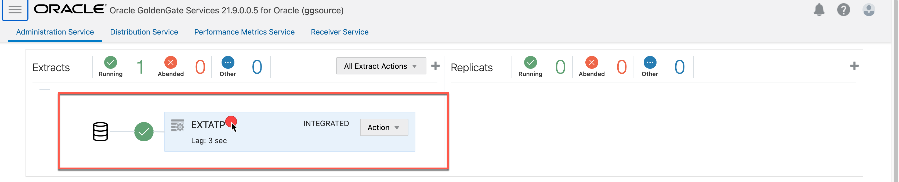
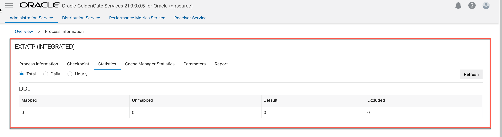
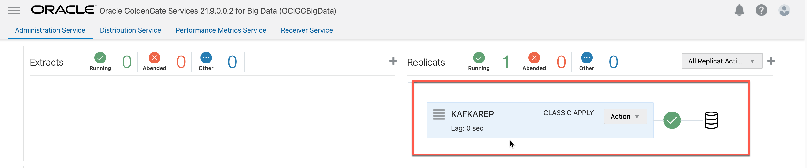
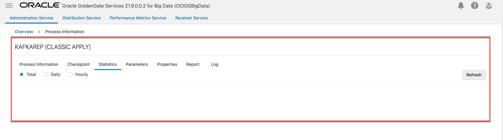
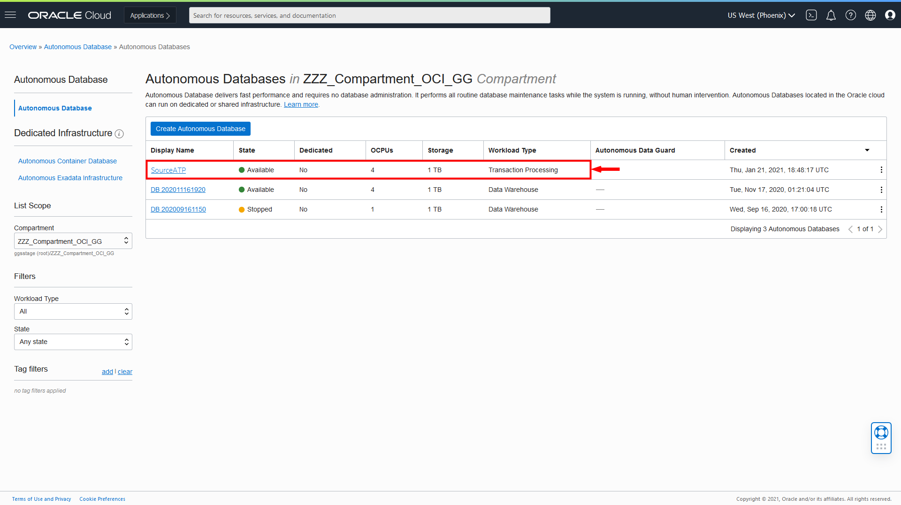
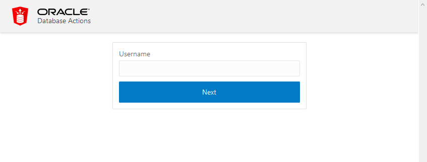
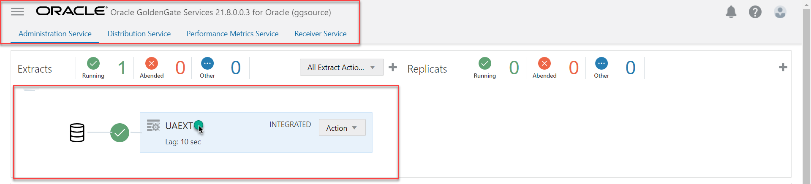
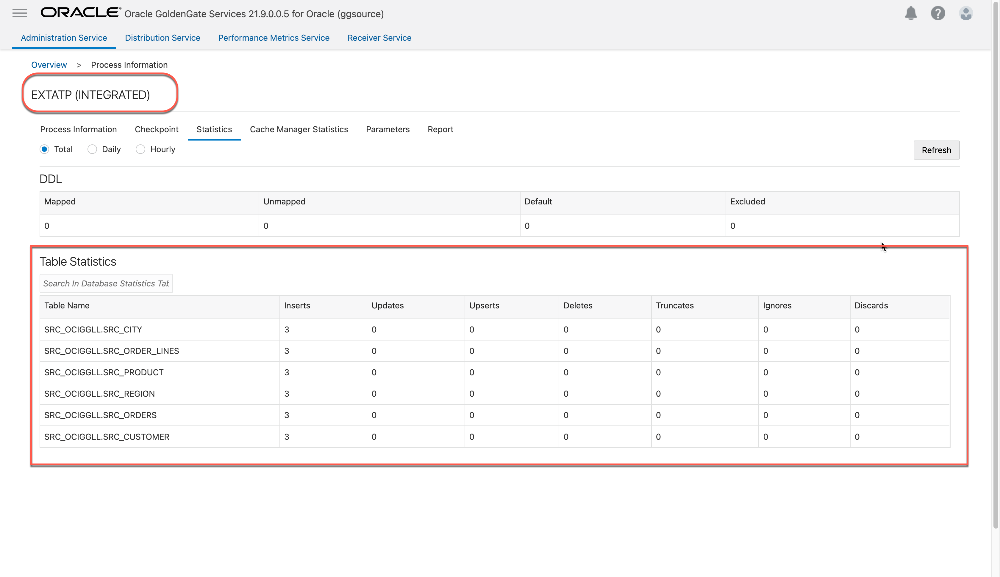
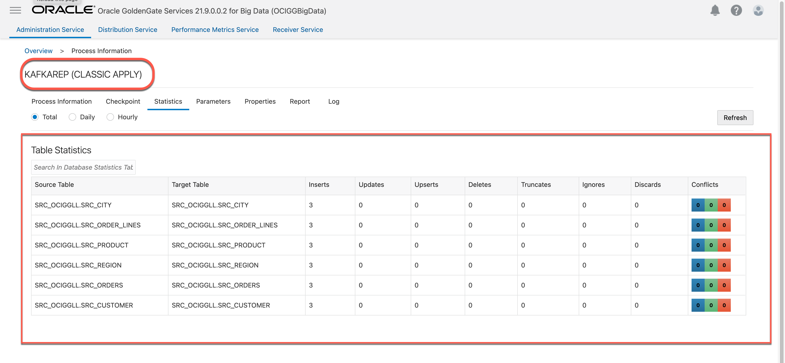
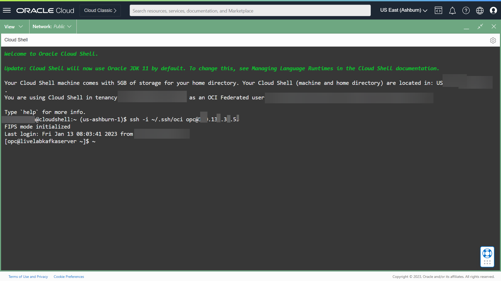

# Load the data to ATP

## Introduction

This lab walks you through the steps to create and run an Extract in the Oracle Cloud Infrastructure (OCI) GoldenGate Deployment Console.

Estimated Time: 15 minutes

### About Trandata 

Use ADD TRANDATA to enable Oracle GoldenGate to acquire the transaction information that it needs from the transaction records.


### Objectives

In this lab, you will:
* Log in to the OCI GoldenGate deployment console
* Add transaction data and a checkpoint table


### Prerequisites

This lab assumes that you completed all preceding labs, and your deployment is in the Active state.

## Task 1: Statistics of the extract and replicat before loading the data to ATP.

1.  Use the Oracle Cloud Console navigation menu to navigate back to GoldenGate.

2.  On the Deployments page, select **GGSDeployment**.

3.  On the Deployment Details page, click **Launch Console**.

    

4.  On the OCI GoldenGate Deployment Console sign-in page, enter **oggadmin** for User Name and the password you provided when you created the deployment, and then click **Sign In**.

    

    You're brought to the OCI GoldenGate Deployment Console Home page after successfully signing in.

5. Click on the extract name ***UAEXT*** and Navigate to **Statistics** tab. Verify there will be **no transaction statistics** for any tables.
     
        


6.  Use the Oracle Cloud Console navigation menu to navigate back to GoldenGate.

7.  On the Deployments page, select **OCI GoldenGate Big Data**.

3.  On the Deployment Details page, click **Launch Console**.

    

4.  On the OCI GoldenGate Deployment Console sign-in page, enter **oggadmin** for User Name and the password you provided when you created the deployment, and then click **Sign In**.

    

    You're brought to the OCI GoldenGate Deployment Console Home page after successfully signing in.

5. Click on Replicat name ***kafkaRep*** and Navigate to **Statistics** tab. Verify that **each table** will have ***5*** inserts.
    
    

   


## Task 2: Load a data to source ATP schema

1.  In the OCI Console, select your ATP instance from the Autonomous Databases page to view its details and access tools.

    

2.  Click **Open DB Actions**.

3.  Log in with the ADMIN user and password provided when you created the ATP instance.

    

4.  From the Database Actions menu, under **Development**, select **SQL**.

    

5.  (Optional) Click **X** to close the Help dialog.

7.  Copy the SQL query and paste it into the **SQL** Worksheet**. Click **Run Script**. The Script Output tab displays confirmation messages.

    ```
    <copy>
    Insert into SRC_OCIGGLL.SRC_CITY  values (10,'Houston',20,743113);
    Insert into SRC_OCIGGLL.SRC_CITY  values (11,'Dallas',20,822416);
    Insert into SRC_OCIGGLL.SRC_CITY  values (12,'San Francisco',21,157574);
    Insert into SRC_OCIGGLL.SRC_ORDER_LINES values (1,1,1,549,59292);
    Insert into SRC_OCIGGLL.SRC_ORDER_LINES values (1,2,2,1477,146223);
    Insert into SRC_OCIGGLL.SRC_ORDER_LINES values (1,3,3,1163,20934);
    Insert into SRC_OCIGGLL.SRC_PRODUCT values (1,'Gold Watch',120,'Watches');
    Insert into SRC_OCIGGLL.SRC_PRODUCT values (2,'Silver Watch',110,'Watches');
    Insert into SRC_OCIGGLL.SRC_PRODUCT values (3,'Earrings',20,'Jewels');
    Insert into SRC_OCIGGLL.SRC_REGION values (20,'South',1,'USA');
    Insert into SRC_OCIGGLL.SRC_REGION values (21,'West',1,'USA');
    Insert into SRC_OCIGGLL.SRC_REGION values (22,'East Coast',1,'USA');
    Insert into SRC_OCIGGLL.SRC_ORDERS  values (1,'COM',1001,to_date('11-JAN-01','DD-MON-RR'),null);
    Insert into SRC_OCIGGLL.SRC_ORDERS  values (2,'CLO',1002,to_date('12-FEB-99','DD-MON-RR'),null);
    Insert into SRC_OCIGGLL.SRC_ORDERS  values (3,'CLO',103,to_date('23-MAR-90','DD-MON-RR'),null);
    Insert into SRC_OCIGGLL.SRC_CUSTOMER values (101,0,'Brendt','Paul','10 Jasper Blvd.',107,'(212) 555 2146',19,10);
    Insert into SRC_OCIGGLL.SRC_CUSTOMER values (102,0,'McCarthy','Robin','27 Pasadena Drive',11,'(214) 555 3075',29,11);
    Insert into SRC_OCIGGLL.SRC_CUSTOMER values (103,0,'Travis','Peter','7835 Hartford Drive',12,'(510) 555 4448',34,12);
    commit;

    </copy>
    ```
    

## Task 3: Statistics of the extract and replicat, post data loading to the ATP.

1. Switch back to OCI GoldenGate Oracle deployment ***GGSDeployment***. Click on the extract name ***UAEXT*** and Navigate to the **Statistics** tab. Verify that **each table** will have ***3*** inserts.
     
      

2. Switch back to OCI GoldenGate Big Data deployment ***OCIGGBigData***.Click on the replicat name ***KAFKAREP*** and Navigate to the **Statistics** tab. Verify that **each table** will have ***3*** inserts.

    
    
    

## Task 4 : (optional) List and view the content of the topic on the Kafka server.

1. Open a Cloud Shell to log on to the Kafka server.

    

2. Copy the ssh connecting string from Cloud Shell terraform output. and paste it into a Cloud Shell.

     
    
3. Execute ***listtopic*** to list all the topics.
     

4. To view the content of the topic. Execute ***consumetopic topic-name***
    
    ```
    example : <copy> consumetopic SRC_OCIGGLL.SRC_CITY </copy>
    ```
     


## Acknowledgements
* **Author** - Madhu Kumar S, Senior Solution Engineer, AppDev and Integration
* **Contributors** -  Deniz Sendil, Database Product Management
* **Last Updated By/Date** - 
