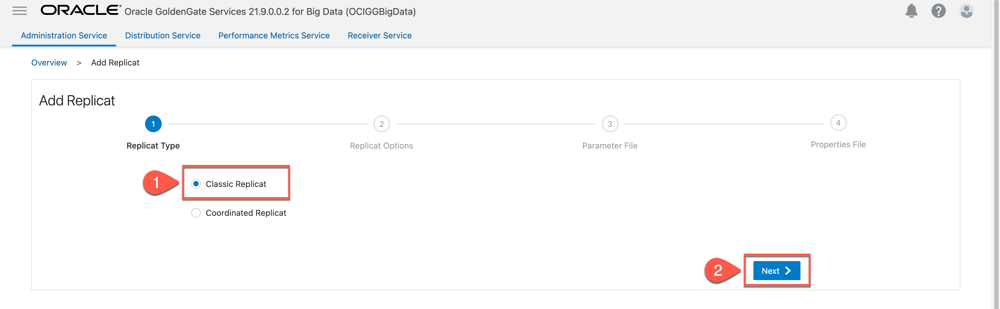

# Create and run the Replicat

## Introduction

This lab walks you through the steps to create a replicat for OCI GoldenGate  Deployment. 

Estimated Time: 10 minutes


### About Replicat

The Replicat process runs on the target system, reads the trail on that system, and then reconstructs the DML or DDL operations and applies them to the target Apache Kafka. Replicat uses dynamic SQL to compile a SQL statement once, and then execute it many times with different bind variable

### Objectives

In this lab, you will:
* Locate Oracle Cloud Infrastructure GoldenGate in the Console
* Create a replicat for OCI GoldenGate  Deployment.
### Prerequisites

This lab assumes that you completed all preceding labs.

## Task 1: Add Replicat.

1. In OCI GoldenGate Big Data Deployment Details, click **Launch Console** to access the web UI.

    

2.	Provide **Username** and **Password** to log in to the OCI GoldenGate Big Data Deployment.

    
3.	In Administration Service, click ***“Add Replicat”***.

    
4. Select ***“Classic Replicat”*** and click **“Next”**.
    
5. Provide **“Basic Information”**, for **Process Name** as **kafkaRep**.
6. For **Source** as ***Trail***.
7. For **Trail Name**, enter trail name as ***RT***.
8. For **Target**, choose ***Kafka***
9. For **Available aliases**, choose ***kafka*** which was created previously on **LAB 4 task 2**.
10. Click ***Next***.
    
11.	Review the mappings and click **“Next”**.
    
12. In “Properties File”, provide **topic mapping template** as “***${FullyQualifiedTableName}***”. Click **“Crate & Run”**. 

    ```
    <copy>${FullyQualifiedTableName}</copy> 
    ```

    
    

In this lab, you created a replicat for OCI GoldenGate  Deployment.

You may now **proceed to the next lab**.

## Learn More
* [Creating a Replicat](https://docs.oracle.com/en/cloud/paas/goldengate-service/using/goldengate-deployment-console.html#GUID-063CCFD9-81E0-4FEC-AFCC-3C9D9D3B8953)

## Acknowledgements
* **Author** - Madhu Kumar S, Senior Solution Engineer, AppDev and Integration
* **Contributors** -  Denis Gray, Database Product Management; Jenny Chan, Consulting User Assistance Developer, Database User Assistance
* **Last Updated By/Date** - Madhu Kumar S, Senior Solution Engineer, AppDev and Integration
