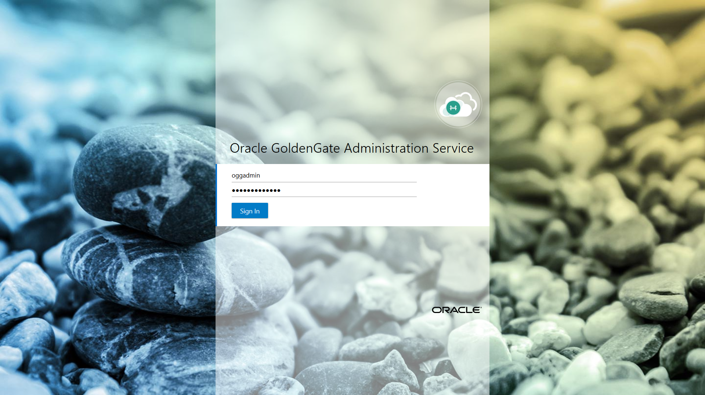
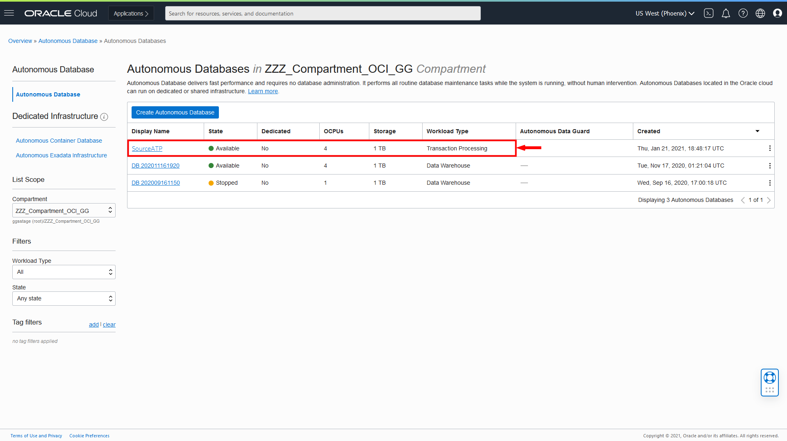
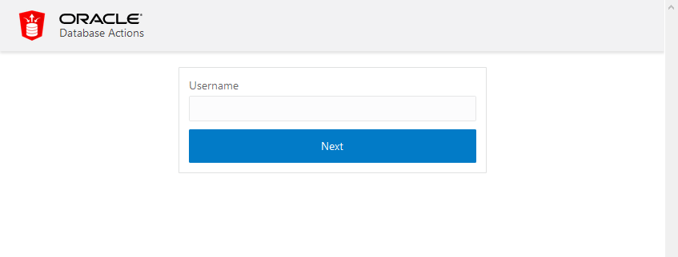
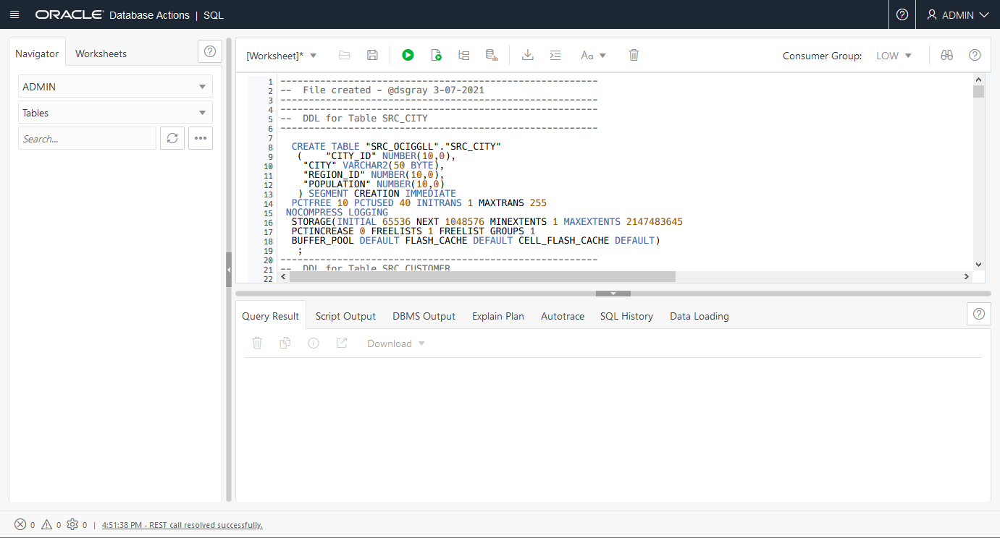
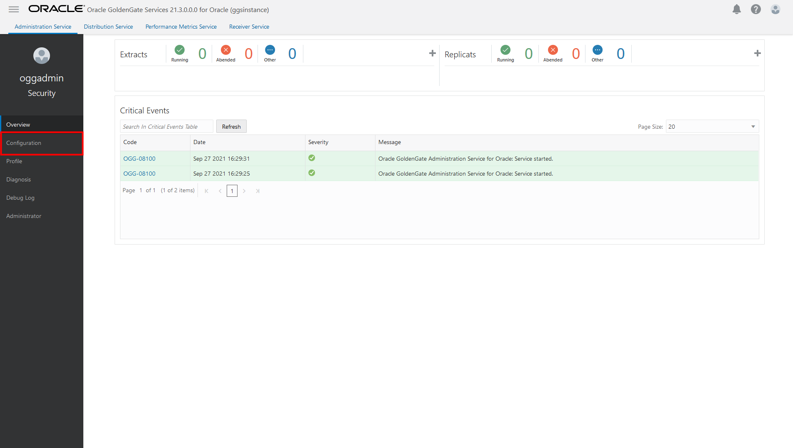
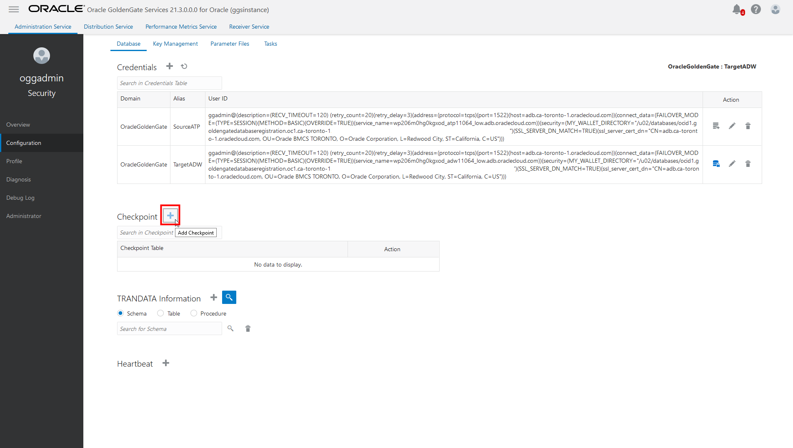

# ADD TRANDATA

## Introduction

This lab walks you through the steps to create and run an Extract in the Oracle Cloud Infrastructure (OCI) GoldenGate Deployment Console.

Estimated time: 15 minutes

### About Trandata 

Use ADD TRANDATA to enable Oracle GoldenGate to acquire the transaction information that it needs from the transaction records.

### Objectives

In this lab, you will:
* Log in to the OCI GoldenGate deployment console
* Add transaction data and a checkpoint table


### Prerequisites

This lab assumes that you completed all preceding labs, and your deployment is in the Active state.

## Task 1: Log in to the Oracle GoldenGate Deployment Console

1.  Use the Oracle Cloud Console navigation menu to navigate back to GoldenGate.

2.  On the Deployments page, select **GGSDeployment**.

3.  On the Deployment Details page, click **Launch Console**.

    

4.  On the OCI GoldenGate Deployment Console sign in page, enter **oggadmin** for User Name and the password you provided when you created the deployment, and then click **Sign In**.

    

    You're brought to the OCI GoldenGate Deployment Console Home page after successfully signing in.

## Task 2: Create a source ATP schema

1.  Click the following link to download the database schema.

    [Archive.zip](./files/Archive.zip)

2.  Save `Archive.zip` to a download directory, and then unzip the file.

3.  Back in the OCI Console, select your ATP instance from the Autonomous Databases page to view its details and access tools.

    

4.  Click **Open DB Actions**.

5.  Log in with the ADMIN user and password provided when you created the ATP instance.

    

6.  From the Database Actions menu, under **Development**, select **SQL**.

    

7.  (Optional) Click **X** to close the Help dialog.

8.  Copy and paste the SQL script from **OCIGGLL\_OCIGGS\_SETUP\_USERS\_ATP.sql** into the SQL Worksheet.

    

9.  Click **Run Script**. The Script Output tab displays confirmation messages.

10. Copy and paste the SQL script from **OCIGGLL\_OCIGGS\_SRC\_USER\_TABLE\_DDL.sql** a new SQL Worksheet.

    

11. Click **Run Script**. The Script Output tab displays confirmation messages.

	>**Note:** *If you find that running the entire script does not create the tables, then try running each table creation statement one at a time until all the tables are created.*

12. In the Navigator tab, look for the SRC\_OCIGGLL schema and then select tables from their respective dropdowns to verify the schema and tables were created. You may need to log out and log back in if you can't locate SRC\_OCIGGLL.

    

13. To enable supplemental logging, run the following command:

    ```
    <copy>ALTER PLUGGABLE DATABASE ADD SUPPLEMENTAL LOG DATA;</copy>
    ```

## Task 3: Add Transaction Data and a Checkpoint Table

> **Note:** *Ensure that you enable supplemental logging before adding an Extract or you may encounter errors. If you encounter errors, delete and add the Extract before trying again.*

1.  Open the navigation menu and then click **Configuration**.

    

2.  Click **Connect to database SourceATP**.

    

3.  Next to **TRANDATA Information** click **Add TRANDATA**.

    

4.  For **Schema Name**, enter **SRC\_OCIGGLL**, and then click **Submit**.

    

5.  To verify, click **Search TRANDATA**, and then enter **SRC\_OCIGGLL** into the Search field and click **Search**.

    

    

6.  Click **Connect to database SourceADW**.

    

7.  Next to Checkpoint, click **Add Checkpoint**.

    

8.  For **Checkpoint Table**, enter **"SRCMIRROR\_OCIGGLL"."CHECKTABLE"**, and then click **Submit**.

    

To return to the GoldenGate Deployment Console Home page, click **Overview** in the left navigation.


## Learn more

* [ADD TRANDATA](https://docs.oracle.com/en/middleware/goldengate/core/21.3/gclir/add-trandata.html)


## Acknowledgements
* **Author** - Madhu Kumar S, AppDev and Integration, Bangalore Tech Teame
* **Contributors** -  Deniz Sendil, Database Product Management; Jenny Chan, Consulting User Assistance Developer
* **Last Updated By/Date** - 
