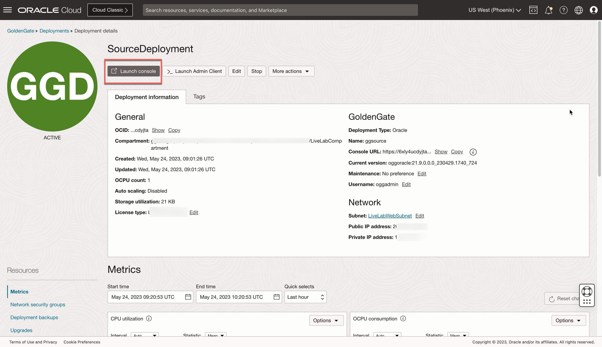
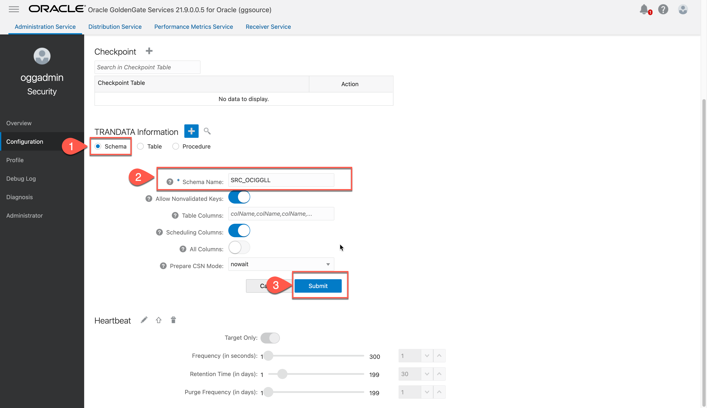
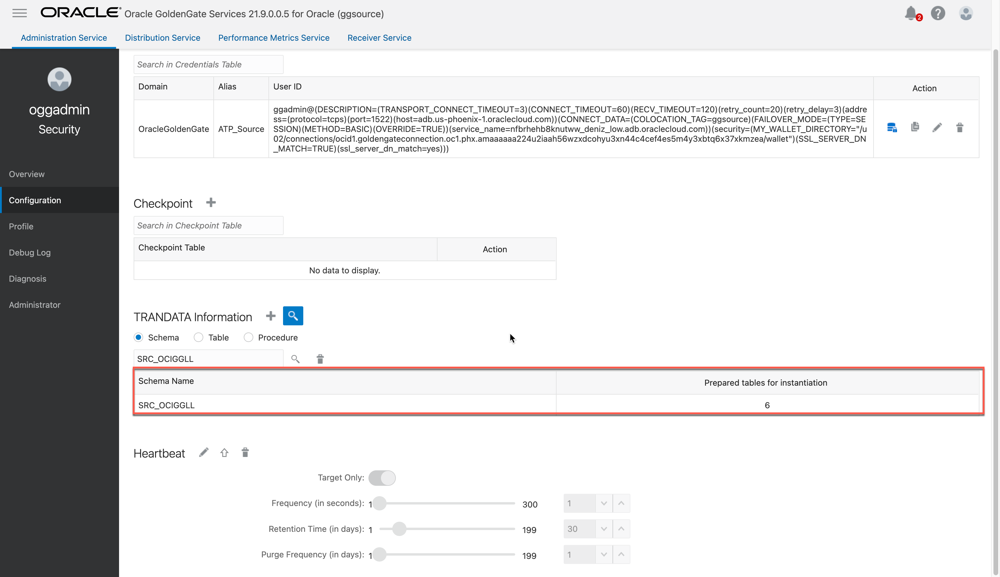

# Create a source ATP schema and add trandata

## Introduction

This lab walks you through the steps to create and run an Extract in the Oracle Cloud Infrastructure (OCI) GoldenGate Deployment Console.

Estimated time: 15 minutes

### About Trandata 

Use ADD TRANDATA to enable Oracle GoldenGate to acquire the transaction information that it needs from the transaction records.

### Objectives

In this lab, you will:
* Log in to the OCI GoldenGate deployment console
* Add transaction data and a checkpoint table


### Prerequisites

This lab assumes that you completed all preceding labs, and your deployment is in the Active state.


## Task 1: Create a source ATP schema

1.  In the OCI Console, select your ATP instance from the Autonomous Databases page to view its details and access tools.

    

2.  Click **Open DB Actions**.

3.  Log in with the ADMIN user and password provided when you created the ATP instance.

    

4.  From the Database Actions menu, under **Development**, select **SQL**.

    

5.  (Optional) Click **X** to close the Help dialog.

6.  Copy the SQL query and paste it into the SQL Worksheet. Click **Run Script**. The Script Output tab displays confirmation messages.

    ```
    <copy>
    CREATE USER "SRC_OCIGGLL" IDENTIFIED BY "#OCIGGSr0ck5*";
    GRANT CREATE SESSION TO "SRC_OCIGGLL";
    ALTER USER "SRC_OCIGGLL" ACCOUNT UNLOCK;
    GRANT CONNECT, RESOURCE, DWROLE  TO "SRC_OCIGGLL";
    GRANT UNLIMITED TABLESPACE TO "SRC_OCIGGLL";
    BEGIN
        ORDS.ENABLE_SCHEMA(p_enabled => TRUE,
                        p_schema => 'SRC_OCIGGLL',
                        p_url_mapping_type => 'BASE_PATH',
                        p_url_mapping_pattern => 'SRC_OCIGGLL',
                        p_auto_rest_auth => FALSE);
        commit;
    END;
    /
   </copy>
    ```

    


9. Copy the SQL query and paste it into the **SQL** Worksheet**. Click **Run Script**. The Script Output tab displays confirmation messages.
   
    ```
    <copy>
    --------------------------------------------------------
    --  DDL for Table SRC_CITY
    --------------------------------------------------------
    CREATE TABLE "SRC_OCIGGLL"."SRC_CITY" 
    (   "CITY_ID" NUMBER(10,0), 
        "CITY" VARCHAR2(50 BYTE), 
        "REGION_ID" NUMBER(10,0), 
        "POPULATION" NUMBER(10,0)
    ) ;
    --------------------------------------------------------
    --  DDL for Table SRC_CUSTOMER
    --------------------------------------------------------
    CREATE TABLE "SRC_OCIGGLL"."SRC_CUSTOMER" 
    (	"CUSTID" NUMBER(10,0), 
        "DEAR" NUMBER(1,0), 
        "LAST_NAME" VARCHAR2(50 BYTE), 
        "FIRST_NAME" VARCHAR2(50 BYTE), 
        "ADDRESS" VARCHAR2(100 BYTE), 
        "CITY_ID" NUMBER(10,0), 
        "PHONE" VARCHAR2(50 BYTE), 
        "AGE" NUMBER(3,0), 
        "SALES_PERS_ID" NUMBER(10,0)
    ) ;
    --------------------------------------------------------
    --  DDL for Table SRC_ORDERS
    --------------------------------------------------------

    CREATE TABLE "SRC_OCIGGLL"."SRC_ORDERS" 
    (   "ORDER_ID" NUMBER(10,0), 
        "STATUS" VARCHAR2(3 BYTE), 
        "CUST_ID" NUMBER(10,0), 
        "ORDER_DATE" DATE, 
        "CUSTOMER" VARCHAR2(35 BYTE)
    ) ;
    --------------------------------------------------------
    --  DDL for Table SRC_ORDER_LINES
    --------------------------------------------------------

    CREATE TABLE "SRC_OCIGGLL"."SRC_ORDER_LINES" 
    (   "ORDER_ID" NUMBER(10,0), 
        "LORDER_ID" NUMBER(10,0), 
        "PRODUCT_ID" NUMBER(10,0), 
        "QTY" NUMBER(10,0), 
        "AMOUNT" NUMBER(10,2)
    ) ;
    --------------------------------------------------------
    --  DDL for Table SRC_PRODUCT
    --------------------------------------------------------

    CREATE TABLE "SRC_OCIGGLL"."SRC_PRODUCT" 
    (   "PRODUCT_ID" NUMBER(10,0), 
        "PRODUCT" VARCHAR2(50 BYTE), 
        "PRICE" NUMBER(10,2), 
        "FAMILY_NAME" VARCHAR2(50 BYTE)
    );
    -------------------------------------------------------
     --  DDL for Table SRC_REGION
    --------------------------------------------------------

    CREATE TABLE "SRC_OCIGGLL"."SRC_REGION" 
    (   "REGION_ID" NUMBER(10,0), 
        "REGION" VARCHAR2(50 BYTE), 
        "COUNTRY_ID" NUMBER(10,0), 
        "COUNTRY" VARCHAR2(50 BYTE)
    ) ;
    </copy>
    ```
    

>**Note:** *If you find that running the entire script does not create the tables, then try running each table creation statement one at a time until all the tables are created.*

10. In the Navigator tab, look for the **SRC\_OCIGGLL** schema and then select tables from their respective dropdowns to verify the schema and tables were created. You may need to log out and log back in if you can't locate **SRC\_OCIGGLL**.

    

11. To **enable supplemental logging**, run the following command:

    ```
    <copy>ALTER PLUGGABLE DATABASE ADD SUPPLEMENTAL LOG DATA;</copy>
    ```
12. Run the **alter user** command to unlock the ***ggadmin*** user and set the password for it.

    ```
    <copy>alter user ggadmin identified by Or4cl3--2022 account unlock;</copy>
    ```

## Task 2: Add trandata 

1.  Use the Oracle Cloud Console navigation menu to navigate back to GoldenGate.

2.  On the Deployments page, select **GGSDeployment**.

3.  On the Deployment Details page, click **Launch Console**.

    

4.  On the OCI GoldenGate Deployment Console sign-in page, enter **oggadmin** for User Name and the password you provided when you created the deployment, and then click **Sign In**.

    

    You're brought to the OCI GoldenGate Deployment Console Home page after successfully signing in.

> **Note:** *Ensure that you enable supplemental logging before adding an Extract or you may encounter errors. If you encounter errors, delete and add the Extract before trying again.*

5.  Open the navigation menu and then click **Configuration**.

    

6.  Click **Connect to database SourceATP**.

    

7.  Next to **TRANDATA Information** click **Add TRANDATA**.

    

8.  For **Schema Name**, enter **SRC\_OCIGGLL**, and then click **Submit**.

    

9.  To verify, click **Search TRANDATA**, and then enter **SRC\_OCIGGLL** into the Search field and click **Search**.

    

    


To return to the GoldenGate Deployment Console Home page, click **Overview** in the left navigation.

## Learn more

* [ADD TRANDATA](https://docs.oracle.com/en/middleware/goldengate/core/21.3/gclir/add-trandata.html)


## Acknowledgements
* **Author** - Madhu Kumar S, Senior Solution Engineer, AppDev and Integration 
* **Contributors** -  Deniz Sendil, Database Product Management
* **Last Updated By/Date** - 
